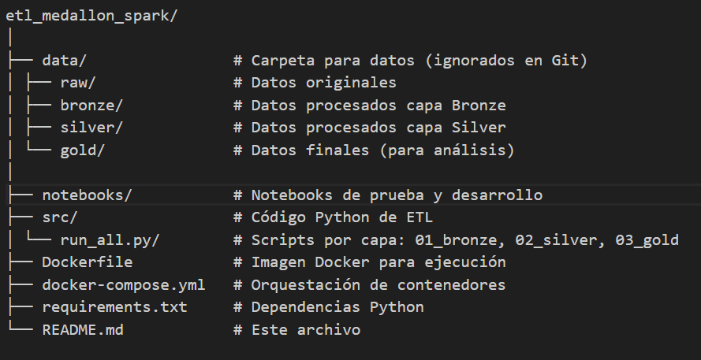

# ETL Medallón con Spark

Este proyecto implementa un flujo ETL tipo medallón (Bronze → Silver → Gold) usando **PySpark**, **Docker** y **Python**.  
Está pensado para pruebas y aprendizaje de pipelines de datos automatizados.

---

## Estructura del proyecto

---

## ⚙️ Requisitos

- **Python** >= 3.8  
- **Java JDK 8 o 11** (requerido por Spark)  
- **Docker** y **Docker Compose**  
- **PySpark**, **py4j**, entre otras dependencias listadas en `requirements.txt`

Todos los recursos pueden correr en entorno local o VM en la nube para pruebas, considerando datos de tamaño moderado.

---

## 🏃‍♂️ Ejecución del proyecto

### 1. Construir la imagen Docker

En la terminal de Visual Studio Code y en la raíz de tu proyecto, ejecuta: **docker-compose build**

### 2. Ejecutar el flujo ETL completo

Luego y después de la construcción del docker.compose, ejecuta: **docker-compose up**

Esto ejecutará automáticamente los scripts en el orden:
**01_bronze_layer.py → 02_silver_layer.py → 03_gold_layer.py**

---

### Automatización con run_all.py

python src/run_all.py

Esto garantiza que los scripts corran en secuencia, registrando logs y errores.

---

## 📝 Buenas prácticas incluidas

- Arquitectura medallón: separación clara de capas de datos
- Dockerización: reproducibilidad y portabilidad
- Estandarización de scripts: ejecución secuencial y modular
- Control de versiones Git: ignorando datos pesados y temporales
- Documentación clara: README profesional para compartir y colaborar

---

## 👤 Autor

Germán – Ingeniero Civil Industrial, especialista en análisis de datos, procesos ETL y automatización de pipelines.

---

## 📖 Referencias y recursos

- PySpark Documentation
- Docker Documentation
- Docker Compose Documentation